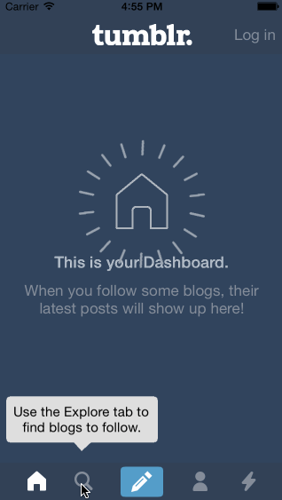

CodePath_Tumblr
=============

This is a tumblr iOS app for customized tab view.

### Hours to Complete
About 10 hours.

### Completed Stories
 * [x] REQUIRED: Tapping on Home, Search, Account, or Trending should show the respective screen and highlight the tab bar button.
 * [x] REQUIRED: Compose button should modally present the compose screen.
 * [x] OPTIONAL: Compose screen is faded in while the buttons animate in.
 * [x] OPTIONAL: Login button should show animate the login form over the view controller.
 * [x] OPTIONAL: Discover bubble should bob up and down unless the SearchViewController is tapped.
  

### Other Notes
 * N/A

### Walkthrough

